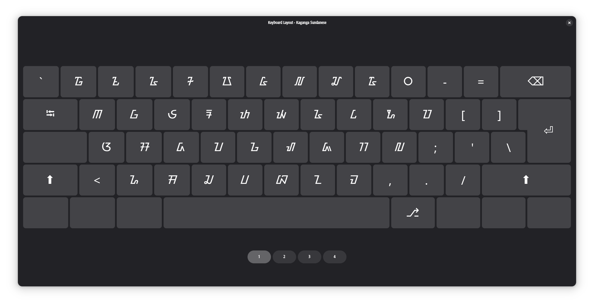
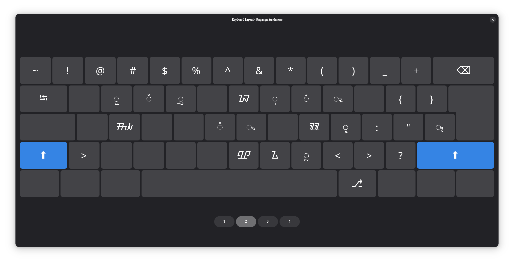
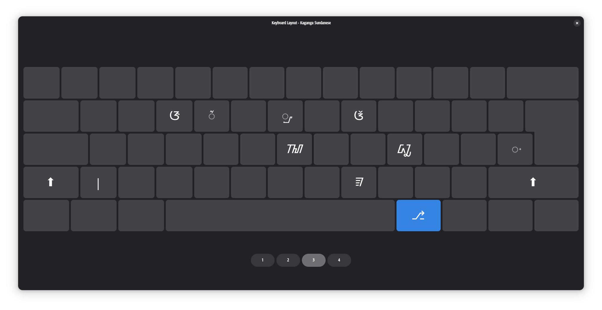
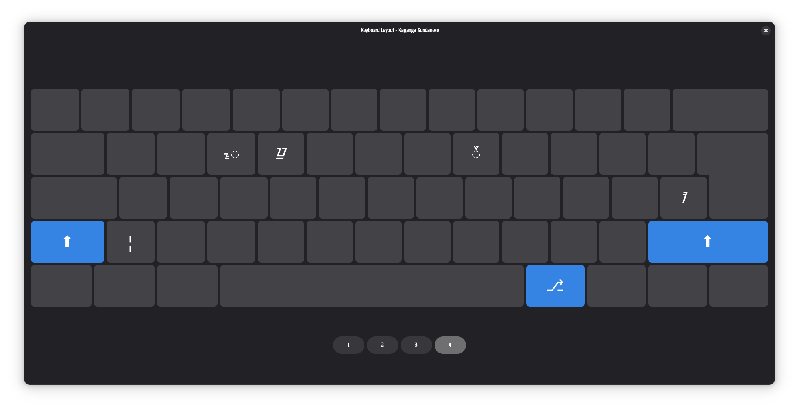

# Traditional Sundanese Script (Aksara Sunda Kaganga) Layout for Linux

### Preview






---

### About

This project is a personal project i've made because i need **Sundanese Script (Aksara Sunda)** natively without third party apps like keyman (yet the official kairaga made this keyman thing) that the procedure is really not user friendly and also unstable, so i wanna make a kinda custom layout for that with efficient way to do, since i used GNOME so there's a feature for custom layout natively, so far i haven't tested in other desktop environtment, but it's works fine on GNOME, i'll update more if i've do it or you're.

---

### Mapping Layout

This Keyboard Layout has Four Level Input:
_Basic input, Shift input, R-Alt Input, and Shift + R-Alt Input_. Using this way you can easily input your keys not in random place like on Windows Inputs.

***Basic Input***:

| From (Keys) | To  | Output |
| --- | --- | --- |
| Q   | Qa  | ᮋ   |
| W   | Wa  | ᮝ   |
| E   | E   | ᮈ   |
| R   | Ra  | ᮛ   |
| T   | Ta  | ᮒ   |
| Y   | Ya  | ᮚ   |
| U   | U   | ᮅ   |
| I   | I   | ᮄ   |
| O   | O   | ᮇ   |
| P   | Pa  | ᮕ   |
| A   | A   | ᮃ   |
| S   | Sa  | ᮞ   |
| D   | Da  | ᮓ   |
| F   | Fa  | ᮖ   |
| G   | Ga  | ᮌ   |
| H   | Ha  | ᮠ   |
| J   | Ja  | ᮏ   |
| K   | Ka  | ᮊ   |
| L   | La  | ᮜ   |
| Z   | Za  | ᮐ   |
| X   | Xa  | ᮟ   |
| C   | Ca  | ᮎ   |
| V   | Va  | ᮗ   |
| B   | Ba  | ᮘ   |
| N   | Na  | ᮔ   |
| M   | Ma  | ᮙ   |
| 1   | Hiji | ᮱   |
| 2   | Dua | ᮲   |
| 3   | Tilu | ᮳   |
| 4   | Opat | ᮴   |
| 5   | Lima | ᮵   |
| 6   | Genep | ᮶   |
| 7   | Tujuh | ᮷   |
| 8   | Dalapan | ᮸   |
| 9   | Salapan | ᮹   |
| 0   | Enol | ᮰   |

***Shift Input***

| From (Keys) | To  | Output |
| --- | --- | --- |
| Shift + W | .wa | ᮭ   |
| Shift + E | .e  | ᮨ   |
| Shift + R | .ra | ᮢ   |
| Shift + Y | Nya | ᮑ   |
| Shift + U | .u  | ᮥ   |
| Shift + I | .i  | ᮤ   |
| Shift + O | .o  | ᮧ   |
| Shift + S | Sya | ᮯ   |
| Shift + G | ..ng | ᮀ   |
| Shift + H | ..h | ᮂ   |
| Shift + K | K Final | ᮾ   |
| Shift + L | .la | ᮣ   |
| Shift + \ | *pamaeh* | ᮪   |
| Shift + B | Bha | ᮽ   |
| Shift + N | Nga | ᮍ   |
| Shift + M | .ma | ᮬ   |

***R-Alt Input***

| From (Keys) | To  | Output |
| --- | --- | --- |
| R-Alt + E | é | ᮆ   |
| R-Alt + R | ..r |  ᮁ |
| R-Alt + Y | .ya | ᮡ   |
| R-Alt + I | eu  | ᮉ   |
| R-Alt + H | Kha | ᮮ   |
| R-Alt + L | Leu | ᮼ   |
| R-Alt + \ | *virama* | ᮫   |
| R-Alt + M | Final M | ᮿ   |

***Shift + R-Alt Input***

| From (Keys) | To  | Output |
| --- | --- | --- |
| Shift + R-Alt + E | .é | ᮦ   |
| Shift + R-Alt + R | Reu | ᮻ   |
| Shift + R-Alt + I | .eu | ᮩ   |
| Shift + R-Alt + \ | Avagraha | ᮺ   |

---

### Installation

The installation is finely easy just:

```
Download the released deb packages
```
and... Install

```shell
sudo apt install /path/to/kaganga-sundanese-layout.deb
```

that's all.

---

### Post Installation

Things you need to know after the installation:

1. *Terminal Notice*, the installation is fine but if you don't want this, just copy to /tmp/ folder first.
  
  ```
  Notice: Download is performed unsandboxed as root as file 'path/to/kaganga-sundanese-layout.deb' couldn't be accessed by user '_apt'. - pkgAcquire::Run (13: Permission denied)
  ```
  

2. *Restart or Relog*, there's no change if you haven't restart it, dont do
  
  ```
  Alt + F2 -> restart / r (it doesn't work)
  ```
  
3. *Font*, so far there's no native font in this packages, so you need to install it manually, i suggest install Kairaga Font or Noto Sans Sundanese for working with this layout.
  
  [Kairaga](kairaga.com) | [Google Font](font.google.com)
  
  ---
